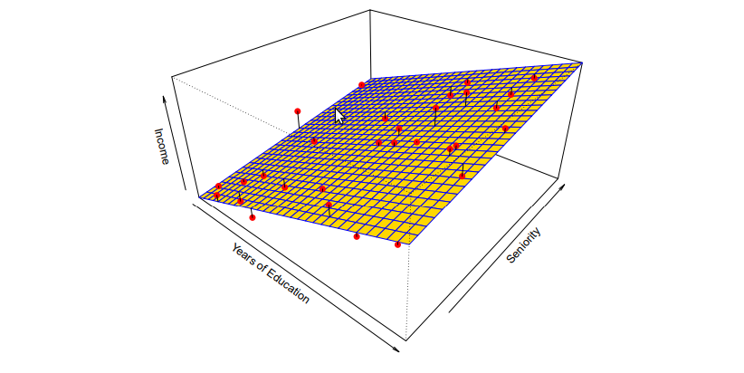

# Statistical learning 

## What is this ?

* Input --> Output ==> X --> F(X)

* New case: New $X_{p}$ --> Can we predict the $F(X_{p})$
* General : $Y = F(x) + \epsilon$ 
* Predict function : $\hat{Y} = \hat{F}(x) + \epsilon$ where $\epsilon$ is a error term, which independent of X and has mean nearly 0.

### Why we has to estimate F ?

* Prediction: Help to improve the output --> For more information to prepare
  * Reducible error: Can handle by improving the $\hat{F}$
  * Irreducible error: Base on the $\epsilon$, this is value, cannot change. The $\epsilon$ contain some variables in $Y$ that we not calculate it in $F(X)$
  * Equation: 
  $$
    \begin{split}
    E(Y - \hat{Y})^2 
    &= E[F(X) + \epsilon -  \hat{F}(X)]^2 \\ &= [F(X) + \hat{F}(x)]^2 + Var(\epsilon)
    \end{split}
  $$
    * Where E is the expected value, the avarage, Var is the variance - Show how the data points is different from the mean.
    * Variance: 
    $$
      S^2 = \frac{\sum^{n}_{i = 1} (x_{i} - \overline{x})^2} {n - 1}
      \\ 
      S^2 : Variance,\\ \overline{x} : means \ of \ x, \\n : Num \ of \ data \ points
  $$
* Inference: Three question
  * What predictors are associted with the response? 
  * What is the relationship between the response and the predictors ?
  * Can the relationship between Y and X perform into a linear equation ?
### How to estimate F ?

*  Parametric method
    * Solving this equation:
    $$ 
      F(X) = \beta_{0} + \beta_{1}X_1 + \beta_{2}X_2 + ...  + \beta_{p} + X_p  
    $$
    * I think that $X$ is the vector has 1 --> J values
    

    $Income = \beta_{0} + \beta_{1}Years + \beta_{2}Senority$
    * So that I think $p$ is number of X, and $n$ is number of data in this X.

### Regression vs Classification

* Quantitive: A numerical number (wage, age, height, stock) --> Regression 
* Qualitative: A values of one of K classes (Man, Woman, married, not married, brand A, B , C) --> Classification

## Accessing model accuracoy

